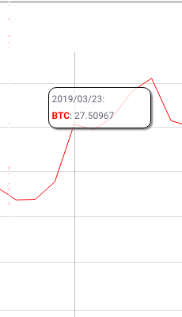

### Simple Kalichkin NVT Fetcher for BTC market

The Network Value to Transactions (NVT) ratio measures the dollar value of cryptoasset transaction activity relative to network value. This is a simple way to compare how the market prices one unit of on-chain transactions across different networks.

Generally speaking, a “low” market to transaction value denotes an asset which is more cheaply valued per unit of on-chain transaction volume.

Network value consists of the total market value of all tokens in circulation. The transaction element is an estimate of the value of on-chain transaction activity drawn from block explorers and blockchains.

---
### How does it work


The code is build with [Typescript](https://www.typescriptlang.org/)

- It fetches the queries from [sqlite3](sqlite3) database 
- 

- It uses chrome headless with [puppeteer](https://github.com/GoogleChrome/puppeteer) to grab the canvas rendered screenshot at the last interval

- 

- enlarges it with [sharp](https://sharp.pixelplumbing.com) then 
- extracts the text from [tesseract](https://github.com/naptha/tesseract.js#tesseractjs) 
image recognition models

- Saves it into `history` table

- 

- sends the results by email using [mailgun](mailgun.com)

---

#### Development

You will need the following env vars or using a `.env` file:
```
PORT=8888
MAILGUN_API_KEY=239e8293e72398whateverwhatever
MAILGUN_DOMAIN=sandbox23892y3e82whatever.mailgun.org
MAILGUN_RECIPIENTS=your_email@gmail.com
```

- Edit the `seed.ts` to your liking

Then after `npm install` install run *once*: `npm run seed`

Locally:

`npm install && npm run build && npm run fastLocal`

To get the code coverage:
`npm run coverage`

To run the tests in watch mode:
`npm run watch`

##### Debugging

`.vscode` launch options are provided for debugging locally

#### On Docker:

- Build the image: `npm run docker-build`
- Run the image: `npm run docker-run`

Alternatively: `docker-compose up`

---

Ideally run on a daily basis with `cron`, ex:
2am every day:
```
0 2 * * * /usr/local/node /your/code/path/build/server.js
```

Ex on my mac local:
```
* 2 * * * /usr/local/bin/node /Sites/nvt/build/server.js >> /Sites/nvt/cron.log 2>&1
```